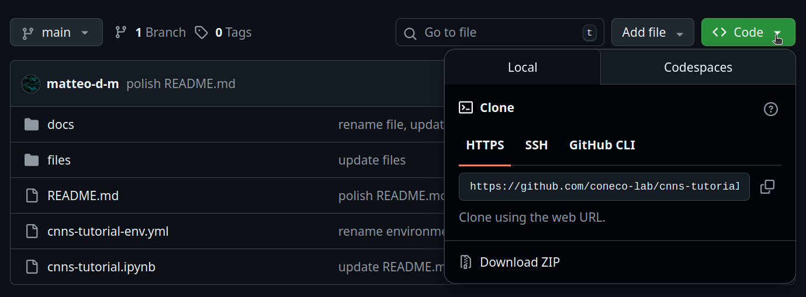

# **Convolutional Neural Networks and Neuroscience: <br /> A Tutorial Introduction for The Rest of Us**

[](https://doi.org/10.5281/zenodo.18877509)

This repository contains a tutorial introduction to the theory and practice of convolutional neural networks &mdash; by neuroscientists, for neuroscientists. 

The material has also been formatted as a paper and published on bioRxiv: 

> De Matola, M. & Arcara, G. (2026). Convolutional Neural Networks and Neuroscience: A Tutorial Introduction for The Rest of Us. bioRxiv 2026.03.09.710521. https://doi.org/10.64898/2026.03.09.710521

:arrow_right_hook: **Repository structure**

```bash
cnns-tutorial/
├── docs/                      # supplementary documents that may be of interest
├── files/                     # supplementary files (e.g., images)
├── LICENSE.md                 # the license for this work (CC BY-NC-ND 4.0)
├── README.md                  # the file you are reading, the information you need
├── cnns-tutorial-env.yml      # installation file 
└── cnns-tutorial.ipynb        # step-by-step implementation of the paper's contents
```

## Jump To
- [General Facts](#general-facts)
- [How To Use This Repository](#how-to-use-this-repository)
- [Installation Instructions](#installation-instructions)
- [Credits](#credits)
- [Contacts](#contacts)

## General Facts
This material aims to demystify CNNs in the eyes of neuroscientists that read about them or use them in their work, but have never understood their inner workings. 

All the code is contained in `cnns-tutorial.ipynb`. This is a [Jupyter Notebook](https://jupyter.org/try-jupyter/notebooks/?path=notebooks/Intro.ipynb): an interactive document that contains a mix of executable code and static text, which can be enriched with mathematical formulas, images and videos.

## How To Use This Repository
The notebook `cnns-tutorial.ipynb` includes Python code to implement all the steps of De Matola & Arcara (2026), plus static text and figures to explain them. The text is a reduced version of the one found in the paper, so you can either:

- Read the paper and come here to run the code cells, ignoring the text cells because they are a mere summary of the paper
- Read the paper and come here to revise its contents while seeing them in action, going through both text and code cells
- Ignore the paper and rely exclusively on the notebook. You will miss some in-depth explanations and theoretical considerations, but you will get all the main messages and skills 

If you choose to ignore the paper but find the notebook useful for your published work, we still require you cite us (see [Credits](#credits)).

## Installation Instructions
To run `cnns-tutorial.ipynb`, you can either use [Google Colab](https://colab.research.google.com/) or your own computer. 

If you use Colab, you will not need any installations. Just hit the [](https://colab.research.google.com/github/matteo-d-m/cnns-tutorial/blob/main/cnns-tutorial.ipynb) button and you will be all set. 

If you use your own computer, you will need a Python installation and a few specific packages. Follow the instructions below to obtain them. 

### Option 1: Without Using Git
:point_right: Go straight to point 2 if you already have Python and Anaconda/Miniconda on your computer. 

1. Click on [this](https://github.com/vigji/python-cimec-2025/blob/main/docs/python-installation.md) link and follow the instructions until point 1 included (_Install Jupyter in the base environment_). **Do not go any further than that**.
2. In this repository, click on the green `Code` button, as in the image below. Once you have done that, click on `Download ZIP`

3. Once the download is complete, extract the folder in a directory of your choice
4. Open a terminal (if Linux/MacOS) or Anaconda Prompt (if Windows) and run the following code (**remember to insert your own directory in the first line**):

```
cd <insert the directory where you have extracted the zipped folder>
conda env create -f cnns-tutorial.yml
python -m ipykernel install --user --name cnns-tutorial --display-name "cnns-tutorial"
```

Finally, run the command `jupyter lab cnns-tutorial.ipynb`. This should open `cnns-tutorial.ipynb` in a browser and you should be all set!

### Option 2: Using Git
:point_right: Skip point 1 if you already have Python and Anaconda/Miniconda on your computer. 

1. Click on [this](https://github.com/vigji/python-cimec-2025/blob/main/docs/python-installation.md) link and follow the instructions until point 1 included (_Install Jupyter in the base environment_). **Do not go any further than that**.
2. In a terminal (if Linux/MacOS) or Anaconda Prompt (if Windows), run the following code (**remember to insert your own directory in the first line**):

```
cd <insert the directory where you want to save this project>
git clone https://github.com/coneco-lab/cnns-tutorial.git
cd cnns-tutorial
conda env create -f cnns-tutorial.yml
python -m ipykernel install --user --name cnns-tutorial --display-name "cnns-tutorial"
```

Finally, run the command `jupyter lab cnns-tutorial.ipynb`. This should open `cnns-tutorial.ipynb` in a browser and you should be all set!

## Credits
If you find this work useful, you can cite the corresponding paper:

> De Matola, M. & Arcara, G. (2026). Convolutional Neural Networks and Neuroscience: A Tutorial Introduction for The Rest of Us. bioRxiv 2026.03.09.710521. https://doi.org/10.64898/2026.03.09.710521

## Contacts
:question: Matteo De Matola ([UniTN](https://webapps.unitn.it/du/en/Persona/PER0247884/Curriculum), [GitHub](https://github.com/matteo-d-m))

:mailbox: matteo [dot] dematola [at] unitn [dot] it